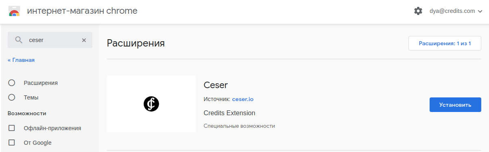
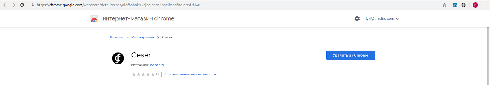
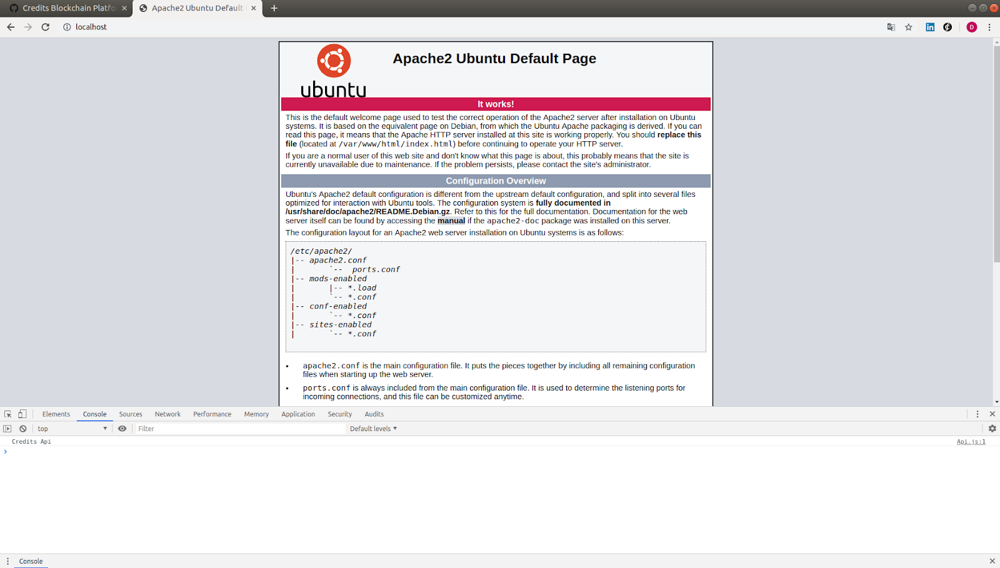
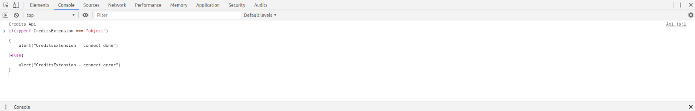
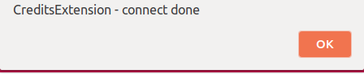

# CESER

CESER - is the decentralized application working like a browser's extension connecting with the blockchain Credits. It allows you to connect directly to the network without entering a password on the sites increasing the security and usability. Create wallets and make transfers.

The goal of CESER (browser extension for Google Chrome & Opera) is to provide more secure and convenient user experience of websites based on Credits. In particular, it manages accounts and connects users to blockchain. Here are some CESER’s features:

• Allows users to manage their accounts and their keys with no context interaction of the site.

• Connects to nodes from different networks remotely. Fast synchronization with no need of waiting. 

## Supported operations 
**User registration using a private key**

* Press the “CS Extension” button in a browser


The window will pop up


**1. If you have a private key**

Type your private key into the “Private Key” field and press the "Login" button.

**2. If you don’t have your private key**

Press “Create Key” button. The “key.json” file will be downloaded along with both public and private keys. Next, repeat the step from “1. If you have a private key” option. 

* Click the “Login” button. The following window will open: 


## Transaction Creation
 
In order to create a transaction, click the “Make a transaction” button. The window view: 


## Fill out the fields in order to create and send a transaction.

1. Receiver’s address

2. Asset (choose a token type)

3. Amount (number of coins to be transferred) 

* Press the “Send transaction” button. If all information was entered correctly, then the following window will be displayed asking to confirm a transaction.


* Confirm the transaction by pressing the “Confirm Transaction” button. It can be seen that the transaction was send successfully:


# Account Information

After pressing the “Receive” button


It will take you to 


Here you can see account details. Also, information can be found through QRCode or the monitor page by clicking the “See on Monitor” button. 

# Guide For Developers

**Download & Install**

# Connect to CESER

Install the free google chrome extension - “ceser”



Icon appears in the upper left corner:



Installation completed

For application development, use the listened localhost

// for example server Apache 2.0

Ubuntu 18.04: 


```
sudo apt-get install apache2
service apache2 start
```




Open the console in your browser F12

Enter the following code to check


<table>
  <tr>
   <td><code>if(typeof CreditsExtension === "object"){</code>
<p>
<code> \
   alert("CreditsExtension - connect done")</code>
<p>
<code>}else{ \
   alert("CreditsExtension - connect error") \
}</code>
   </td>
  </tr>
  <tr>
   <td>
   </td>
  </tr>
</table>


as shown in the screenshot



Click Еnter




Use a localhost connection to develop and debug your application.

To deploy your application for prod, please contact us to put you on the list of credits extention of the real domain name of your product.

To start developing apps using CESER , you can download it here. The object “CreditsExtension” will appear in your console after installing the extension.

**Run up a check on availability of the installed extension (example)**
```
if(typeof CreditsExtension === "object")

{
	//Code

}else{

	// error processing 
}
```
## Set of functions for sending extension calls

**CreditsExtension.authorization()**

• Checks user authorization in extension 

• Awaits the answer

• Object is going to be passed to ```response``` function:
```
{
	message,

        result
}
```

• If ```result``` is ```undefined```, there will be a description of an error in ```message```

• ```result``` is going to have a boolean value with a checking result.

## **Example**
```
CreditsExtension.authorization().then(r => {

if(r.result === undefined){
	alert(r.message);
return;
}
if(r.result)
{
		alert(“user is authorized”)
}else{
	alert(“user is not authorized”)
}
})
```
## CreditsExtension.balanceGet()

• Returns balance by a public key

• The object type will be passed to ```response``` variable
```
{
        message,
        result:{
	Credits_CS - CS user’s balance in a chosen network 
}
}

```

•	If ```result``` is ```undefined```,  there will be a description of an error in ```message```

•	```result``` is going to have a boolean value with a checking result

•	Obj looks like:
```
{
	key: public key whose data is requested 
}
```
**Can be undefined**

If a key is not specified or Obj is _undefined_, then the balance of authorized wallet is going to be returned.

## Call Examples

CreditsExtension.balanceGet().then(r =>  {});

## Example
```
CreditsExtension.balanceGet().then(r =>  {
if(r.result === undefined){
	alert(r.message);
return;
}
// code
})
```

## ok.History(Obj,callBack).It`s need CreditsWork.js file.

•	Returns transaction history by a public key

•	object Obj has a form of: 
```
{
	page: page number,
	size: number of transactions per on page,
	key: public key whose transactions will be returned. If the key is not specified, transactions of an authorized user will be returned. 

}
```

function ```callBack(response)```

The objects will be passed to ```response``` as: 
```
{
	message,
        result
}
```
•	If ```result``` is ```undefined```,  there will be a description of an error in message

•	```result``` will contain an array from object type 
```
{
	id -transaction ID,
	amount – amount transfer in CS,
	fee – transaction fee (commission) in CS,
	source – transaction sender’s public key 
	target - transaction receiver's public key 
	smartContract – smart contract information in a transaction
	smartInfo – smart contract condition information
}
```
## Call example:

* ok.History(YourKey,page,100,function(r){});


## Example
```
var netIp;
var netAport;
CreditsExtension.curNet().then(r =>  
{
    var xhr = new XMLHttpRequest();
xhr.open('GET', 'http://wallet.credits.com/api/"CreditsNetwork or testnet-r4_2 or DevsDappsTestnet"/api/NetWork');
    xhr.onload = function (e) {
        if (xhr.status != 200) {
            alert('Network Request Error!');
        } else {
            let objnet = JSON.parse(xhr.responseText);
            netIp = objnet[0].ip;
            netAport = objnet[0].aport;
            var ok = new CreditsWork(netIp,netAport);
            let page = '1';
            ok.History(YourKey,page,100,function(r)
            {
                if(r === undefined)
                {
                    alert(r.message);
                    return;
                }
                 // code if success
            });
        }
    }       
    xhr.send(null);
});
```

## CreditsExtension.compiledSmartContractCode(Code)

Compiles a smart contract and reports compilation errors if those are found.

• line Code – smart contract code
• The object will be passed to response as:

```
{
	message,
        result
}
```

• If ```result``` is ```undefined```, there will be a description of an error in ```message```
• ```result``` will contain an array from object type 
```
{
	name – class name,
	byteCode – line with a byte code of a smart contract. 
}
```

## Example
```
CreditsExtension.compiledSmartContractCode(code).then(r => {
if(r.result === undefined){
	alert(r.message);
return;
}
console.log(r.result);
});
```
## CreditsExtension.sendTransaction(Transaction)

• Sends a transaction to blockchain;

• The object will be passed to response as:
```
{
	message,
        result
}
```
If ```result``` is ```undefined```, there will be a description of an error in ```message```

To send a transaction for a CS transfer, the Transaction object must have the following form:
```
{
            target: Receiver’s public key ,
            amount: Amount Transfer.  

}
```

## Example
```
CreditsExtension.sendTransaction({
Target: Public key,
Amount: “1.2”
}).then(r => {
if(r.result === undefined){
	alert(r.message);
return;
}
console.log(r.result);
});
```

To complete the smart contract method, the Transaction object must have the following form:
```
{
	    target: Receiver’s public key ,

	    smartContract:
{
            params – parameters being passed to a method, array objects as: 
{
	    k – data types (can be “STRING”, ”INT”, ”BOOL” ),
	    v – transmitted data
}           The sequence of array corresponds to the sequence of arguments in the method.
            method – called method of a smart contract,
}
}
```
## Example
```
CreditsExtension.sendTransaction({
target: Smart contract’s public key,
smartContract:
{
	params: [
	{k:“STRING”, v: “Test”},
	{k:“INT”, v: 2},
	{k:“BOOL”, v: true},
],
method: “Test”
}
}).then(r => {
if(r.result === undefined){
	alert(r.message);
return;
}
console.log(r.result);
});
```

**In order to deploy smart contract, the Transaction object must have the following form:**
 ```
{

	    smartContract:
{
            code: Smart contract code
}
}
```
## Example
```
CreditsExtension.sendTransaction({
	smartContract:
{
            code: “Code”
}
}).then(r => {
if(r.result === undefined){
	alert(r.message);
return;
}
console.log(r.result);
});
```


 

